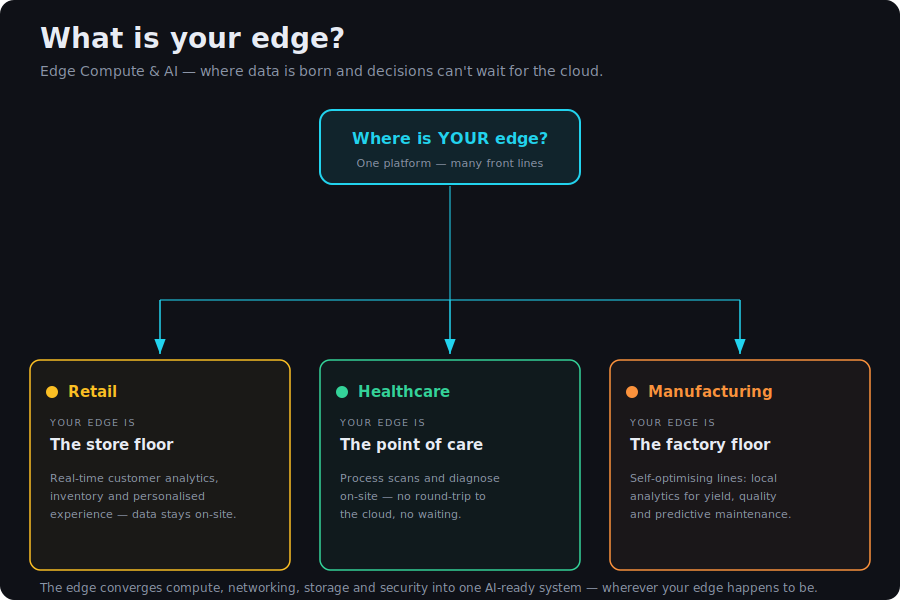

+++
title = "What Is Your Edge?"
date = 2026-06-17
cardSeries = "edge"
draft = false
+++
## What is the Edge?
Edge computing, Edge AI, Edge networking and more are symptomatic of the industry pivoting heavily into demanding new workloads, while having few spare resources to address technical debt. The challenges facing the industry are myriad and increasing when one considers new developments, like the fallout of RAMageddon on hardware availability.

Addressing a challenge always starts with defining the problem space. Definition complexity increases when there are multiple perspectives using multiple names for the same overarching concept. Each name is valid but addresses a marginal difference, ultimately costing coherence when using the term 'Edge'.

As a baseline when I am referring to the Edge, I mean those environments whereby environmentals cannot be guaranteed, power should not be taken for granted, and where SWaP (Size, Weight, and Power) are key in the decision making process. When hardware can't simply be thrown at the problem — see RAMageddon — SWaP stops being a procurement footnote and becomes the constraint that decides what you can deploy at all.

I acknowledge that’s still a pretty wide breadth of verticals & locations. However, it sets the playing field. We are not focusing on telco edge locations with multiple full-sized racks. We are focusing on Edge deployments that need mobility, AC **and** DC powered options, and accommodating sites where racks themselves cannot be deployed.

## What Is Your Edge?
Vendors across the IT field are all targeting the Edge these days. Sometimes that targeting focuses on just the WAN itself, sometimes it is only considering the compute, sometimes it focuses on the whole stack, Compute, AI, Security, Networking. Frankly though, what the vendor’s Edge portfolio looks like is irrelevant until one has a clear vision of their own Edge.

So, what is your edge? Are you in retail and your Edge vision is every store that services your clients? Perhaps you’re in healthcare and your Edge remit focuses more on hospitals, GPs, and pop-up health clinics. Manufacturing organisations with factories, clean & dirty, have multiple Edge locations feeling the double pinch of technical debt (I see you Windows XP for PLCs) and a shove in the direction of Industry 4.0 and Factory of the Future. 

The above are a few examples across a few verticals, but in my view the Edge has a place for most verticals. Would one exclude CoLos? For the above definition, I would. They do not operate under the constraints we have outlined. Would I discount CSPs? No, even CSPs have an Edge vision. Look to Google Distributed Cloud and how it augments Google Cloud Platform at the edge.

Take a minute. Stop & think. What is your Edge? Is it another name for a Remote Office/Branch Office (ROBO)? Before you dismiss it as a fad, think about your current environments, ponder the tech debt. Those legacy servers that cannot meet evolving core requirements (not even talking about AI here), or those networking devices that are still on 100MB down to hosts & have not been patched for at least 2 years, what about those dusty firewalls that have questionable policy consistency (permit all half way down, but everyone’s too afraid to remove it?)

## Why the Sudden Refocus?
The Edge refocus isn't new technology. It's old debt meeting new demand. The infrastructure you already have can't carry what the business now wants to run on it. Why that collision is happening now, and what it forces, is what this series unpacks.
