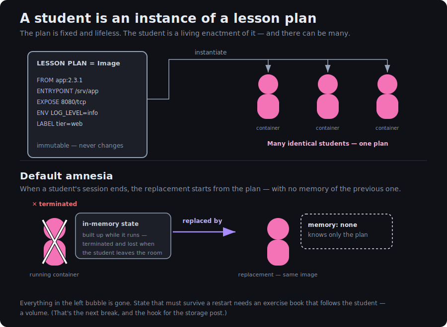

+++
title = "The Student Container"
date = 2026-06-22T00:00:00
cardSeries = "k8s"
draft = false
+++

## Your First Day!
The student arrives at school and is ushered to the correct classroom, directed to the student's desk and sits down. The student is ready to begin the first class, of their first day, at school. The teacher is at the front of the classroom and is preparing to address the delta between the Student's current knowledge and the desired knowledge the syllabus requires. The lesson plan is exciting and brand new to every Student but cannot currently be committed to long-term memory storage, each time the class runs, no Student retains the knowledge as nothing is carried forward. Each seat is taken by a new student each time.

## What makes up a Student?
Students learn based on the lesson plans provided to them. That learning plan can differ each time and this means that the student will be picking up new skills & knowledge. When viewing this from the perspective of a container, the connection here is that the *Lesson Plan* is akin to the *Container Image* and the Student is the container running that image. The image is defined and the container is spun up. The container spins up, a new student enters the classroom, and takes their seat at a desk.

The Student is a running instance of a lesson plan. The container is a running instance of the associated image.

## What Other Mapping Exists?
A Student does not intuit the knowledge of the lesson plan. The knowledge is gained by running the image, engaging in the lesson plan.

A Student is placed in a room and at a desk, like a container is scheduled on a node as a pod. This concept aligns to Container Requests which inform the Scheduler to place the pod on an appropriate node.

Students have Limits on the amount of available calories and the attention they have. These limits are like the available CPU & Memory a container can access. If the container overruns the prescribed Memory limits, it will be terminated & restarted. A Student would be sent out of the classroom with a new Student taking the seat. If CPU is overrun, the Student would be forced to work slower, write slower, learn slower, not sent out.

## Where Intuition Misleads
Typical intuition of a school and students needs addressing to avoid potential misunderstandings. The first note to flag:

* ‘Student Autonomy’, a real student decides when to answer, when to leave, whether to pay attention. A container does not have this, it is started, restarted, and terminated outside its own control. A container runs as an externally controlled, pre-programmed set of instructions.

* ‘One Student, One Job’, a real school student has a requirement to juggle a full timetable across multiple days. They maintain knowledge about Maths, French, Chemistry etc. at the same time, sometimes within the same classroom. A container does not do this, a container has a single function, Maths, and bundling several functions into one is a mistake.

* ‘Present Does Not Equal Ready’, a student sitting at a desk is ready to start learning, ready to be asked. This same logic does not necessarily apply in the same way to containers. Think of this state as the student is in the classroom, sat at the desk, but is still unpacking its backpack. Once the student finishes, a signal is sent to announce readiness.

In the rest of this series, we will address where intuition needs adjusting. Equally, we will call out where the analogy breaks down and not double down on a concept that does not make sense. 

One such example where we won’t patch is Students and persistent identity. A real student has persistent identity, a container is deliberately faceless.

## Student Amnesia
Unlike a typical school and classroom, each student that enters the classroom is brand new. There are no Students that persist after being sent out or sent home from school. The knowledge gained in the lesson, during the container runtime, is lost with the student that gained it. 

This enables each student to be interchangeable within the classroom. Every student, first to last, has the same starting state, but critically no persistence. Each container may have an entirely different runtime experience e.g., one container hits multiple errors, another does not. A note here, there is a way to provide a student a ‘past’, a means to live beyond a single runtime, but this exists outside the student and is a topic of its own.

## End of the Day
This post has kept its focus on the Student alone, and in doing so has leaned on three things without explaining them.

The **desk** the Student sits at has been treated as a given, but the desk is the unit the system actually places and counts. The desk is the next post. Giving a Student a **past**, a means to outlive a single runtime, via Storage, was promised above and will get its own treatment.

Finally, a Student isn't only shaped by the lesson plan baked into them. They are handed a **briefing on the way in** which amounts to freshly supplied instructions each run. As a result the same plan behaves differently from one run to the next. How that briefing works, and how it differs when it carries something sensitive, is a later post.
